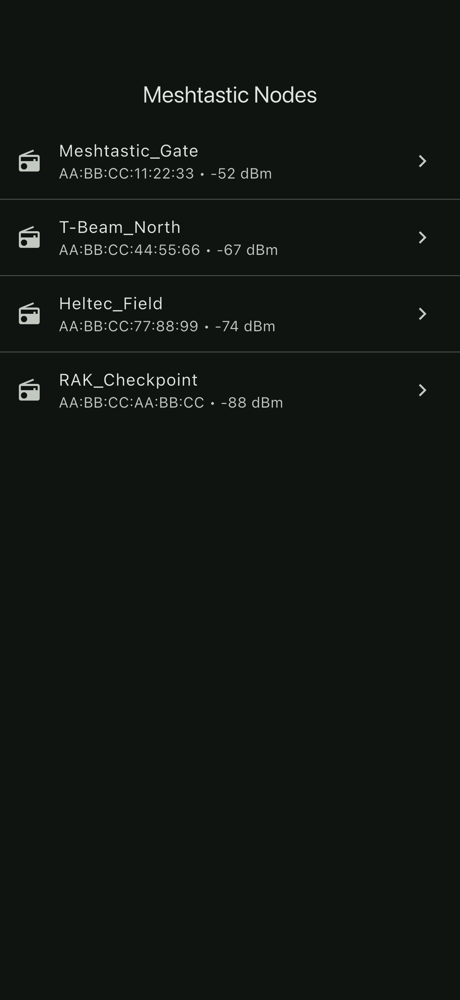
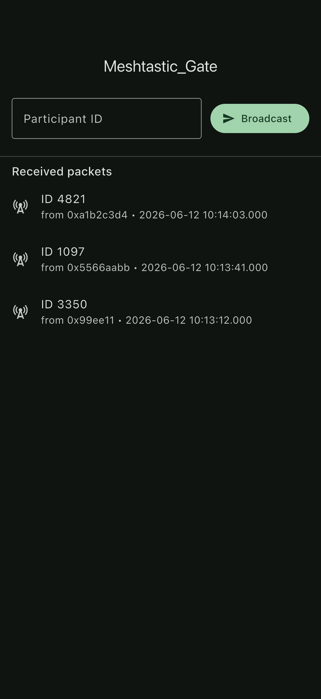
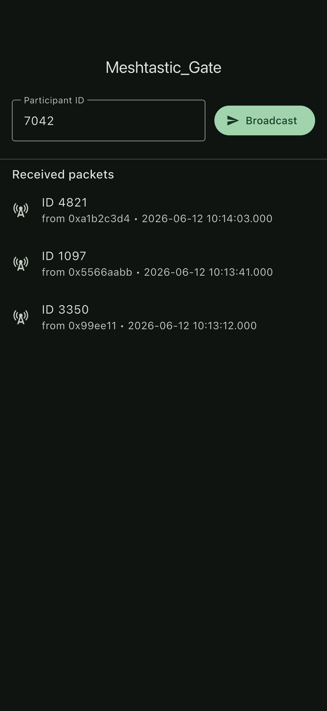

# Flutter Meshtastic BLE Gateway

Flutter POC that connects to a Meshtastic LoRa device over BLE and broadcasts/receives short numeric payloads (e.g. event participant IDs) over the LoRa mesh, giving 200m+ range between phones via the radio.

Designed as a Flutter alternative to the Nearby Connections / WiFi Aware approach used in many short-range Android apps when the device pair needs to talk across a venue instead of across a room.

## Demo

Real iOS-Simulator captures of the running app (see [FLOW.md](FLOW.md) for how they were generated).

| Node scan | Mesh log | Broadcast |
| --- | --- | --- |
|  |  |  |


## Features

- BLE scan filtered by the official Meshtastic GATT service `6ba1b218-15a8-461f-9fa8-5dcae273eafd`
- Connect, subscribe to `fromNum` notify, drain `fromRadio` reads
- Encode/decode a minimal varint payload (participant ID) compatible with the ToRadio/FromRadio envelope
- Broadcast a participant ID number from the client app, decode it on the host app
- Live packet log with RSSI and timestamp
- Riverpod state, autoDispose providers, permission_handler for Android 12+ BLE perms

## Stack

Flutter 3.41, Dart 3.5, `flutter_reactive_ble`, Riverpod, `permission_handler`, Material 3 dark.

## Run

```bash
flutter pub get
flutter run
```

Pair a Meshtastic-flashed ESP32 / T-Beam / Heltec / RAK board over BLE and the device appears in the scan list.

## Files

- `data/mesh_protocol.dart` - Meshtastic GATT UUIDs + minimal varint encoder/decoder
- `data/mesh_client.dart` - BLE wrapper: scan / connect / write ToRadio / drain FromRadio
- `data/mesh_store.dart` - Riverpod providers (scan stream, received packets stream)
- `ui/scan_screen.dart` - Device picker with permission request
- `ui/mesh_screen.dart` - Send participant ID + live receive log

## Use case

Event check-in / participant tracking where Bluetooth + Nearby Connections is too short-range. Phone -> local Meshtastic node -> LoRa mesh -> remote node -> remote phone, all hidden behind one Riverpod stream.
